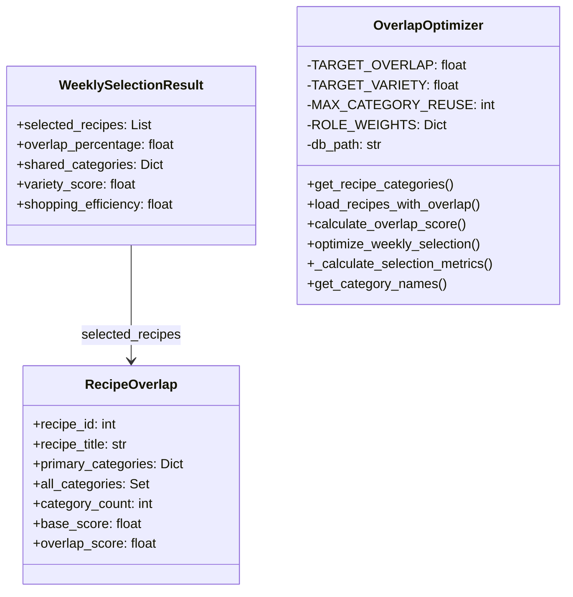

# Skill Output: overlap_optimizer.py — classDiagram

## Graph data summary
- TYPE nodes (classes): RecipeOverlap, WeeklySelectionResult, OverlapOptimizer (3 total)
- SYMBOL nodes: 20 (methods and dataclass fields)
- Structural edges: 1 — WeeklySelectionResult.selected_recipes uses_type RecipeOverlap

## Mermaid diagram

## Reasoning
Edge drawn: WeeklySelectionResult.selected_recipes declared as List[RecipeOverlap] — confirmed by graph uses_type edge on field declaration.
Excluded: produces/consumes edges (function return types = pipeline flow, not structural), calls edges (control flow), OverlapOptimizer method-local usages of RecipeOverlap (not stored as fields).
