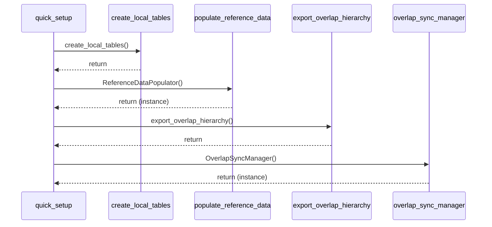

# Skill Output: quick_setup.py — sequenceDiagram

## Graph data summary
- Nodes in quick_setup.py: main (only 2 nodes: file + main symbol)
- Cross-file edges found (by seq field): 4
  - seq 4: main → create_local_tables.py::create_local_tables
  - seq 6: main → populate_reference_data.py::ReferenceDataPopulator
  - seq 11: main → export_overlap_hierarchy.py::export_overlap_hierarchy
  - seq 12: main → overlap_sync_manager.py::OverlapSyncManager
- Actors identified: quick_setup, create_local_tables, populate_reference_data, export_overlap_hierarchy, overlap_sync_manager

## Mermaid diagram

## Reasoning
- Actor rule: 4 cross-file calls edges from main → 4 distinct files = 4 actors + self = 5 actors total
- Ordering rule: seq field (4 → 6 → 11 → 12) gives chronological order
- Omitted: stdlib/os calls (not in project graph), sync_hierarchy_from_server not captured as cross-file edge in graph
- Returns shown as synchronous call-return pairs
