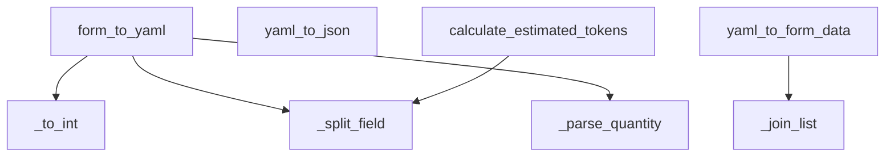

# Skill Output: recipe_yaml_converter.py — flowchart TB

## Graph data summary
- Function nodes found: 8 (form_to_yaml, yaml_to_json, yaml_to_form_data, calculate_estimated_tokens, _split_field, _join_list, _to_int, _parse_quantity)
- Call edges found: 5
  - form_to_yaml → _to_int (seq 1)
  - form_to_yaml → _split_field (seq 6)
  - form_to_yaml → _parse_quantity (seq 11)
  - yaml_to_form_data → _join_list (seq 2)
  - calculate_estimated_tokens → _split_field (seq 1)

## Mermaid diagram

## Reasoning
- Entry points identified: 4 public methods not called by others within the class
- yaml_to_json: external yaml library call only (not in project graph) — isolated node
- _split_field appears as shared callee of form_to_yaml and calculate_estimated_tokens
- Method-level granularity applied: no intra-method branching captured
- seq field confirmed call order within each entry function
