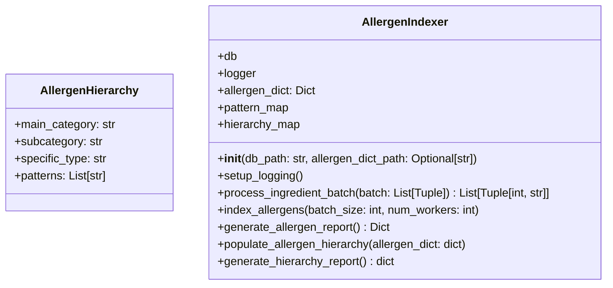

# Ground Truth — allergen_indexer.py — classDiagram

## Metadata
- GT node count: 2
- GT edge count: 0

## Mermaid Diagram

## Class Definitions
- **AllergenHierarchy**: dataclass with 4 fields (all built-in types: str, str, str, List[str])
- **AllergenIndexer**: class with db, logger, allergen_dict: Dict, pattern_map, hierarchy_map; 7 public methods

## Edge Definitions
**None** — `AllergenIndexer.pattern_map` contains AllergenHierarchy objects at runtime, but the declared field type is `Dict` (built-in). Edge rule: draw edges ONLY when declared type = local class. Dict ≠ AllergenHierarchy → no edge.

## Note for grading
This is a 0-edge diagram. Grading focus: does the skill correctly identify BOTH classes, and does it correctly draw NO edges (i.e., not incorrectly infer an edge from runtime usage or method signatures)?
