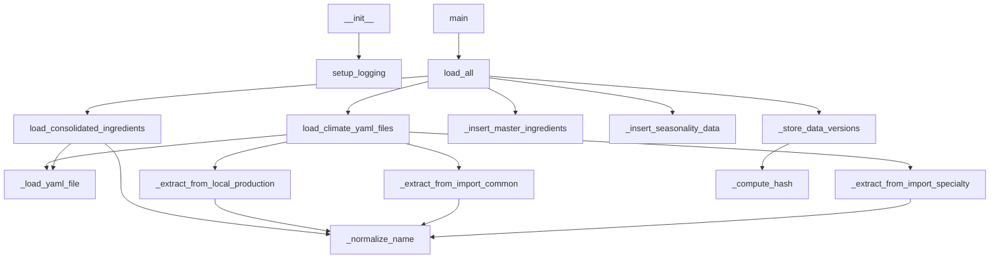

# Ground Truth — climate_ingredients_loader.py — flowchart TB

## Metadata
- GT node count: 15
- GT edge count: 17

## Mermaid Diagram

## Node Definitions
1. `__init__` — constructor; initializes db connection, calls setup_logging
2. `setup_logging` — configure logging StreamHandler
3. `main` — CLI entry point
4. `load_all` — main orchestrator
5. `load_climate_yaml_files` — parse all climate zone YAML files
6. `load_consolidated_ingredients` — parse consolidated ingredients file
7. `_load_yaml_file` — load and parse a single YAML file
8. `_extract_from_local_production` — extract from local_production section
9. `_extract_from_import_common` — extract from import_common section
10. `_extract_from_import_specialty` — extract from import_specialty section
11. `_normalize_name` — normalize ingredient name (lowercase, strip parens)
12. `_insert_master_ingredients` — insert into MasterIngredients table
13. `_insert_seasonality_data` — insert into IngredientSeasonality table
14. `_store_data_versions` — store SHA256 hashes in DataVersions table
15. `_compute_hash` — compute deterministic SHA256 hash

## Edge Definitions
1. `__init__` → `setup_logging`
2. `main` → `load_all`
3. `load_all` → `load_climate_yaml_files`
4. `load_all` → `load_consolidated_ingredients`
5. `load_all` → `_insert_master_ingredients`
6. `load_all` → `_insert_seasonality_data`
7. `load_all` → `_store_data_versions`
8. `load_climate_yaml_files` → `_load_yaml_file`
9. `load_climate_yaml_files` → `_extract_from_local_production`
10. `load_climate_yaml_files` → `_extract_from_import_common`
11. `load_climate_yaml_files` → `_extract_from_import_specialty`
12. `load_consolidated_ingredients` → `_load_yaml_file`
13. `load_consolidated_ingredients` → `_normalize_name`
14. `_extract_from_local_production` → `_normalize_name`
15. `_extract_from_import_common` → `_normalize_name`
16. `_extract_from_import_specialty` → `_normalize_name`
17. `_store_data_versions` → `_compute_hash`
