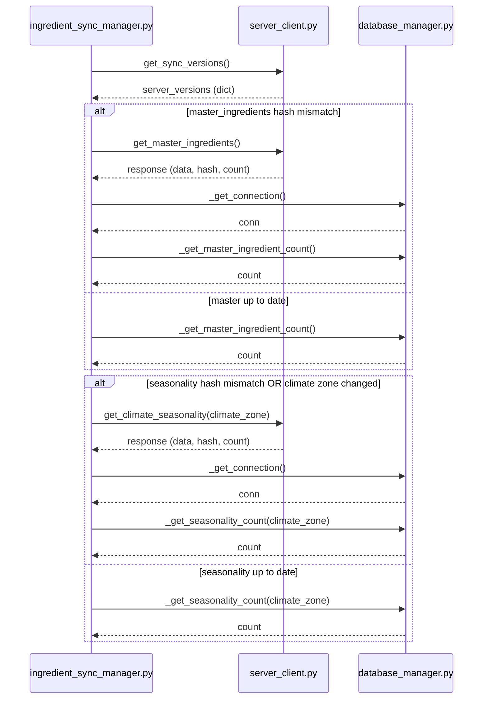

# Ground Truth — ingredient_sync_manager.py — sequenceDiagram

## Metadata
- GT node count: 3 (distinct actors)
- GT edge count: 8 (outgoing cross-file calls, counting conditional branches as separate calls)

## Mermaid Diagram

## Actor Definitions
- **ISM**: Client_Side/utils/ingredient_sync_manager.py
- **SC**: Client_Side/utils/server_client.py
- **DBM**: Client_Side/utils/database_manager.py

## Message Definitions (outgoing calls, in execution order)
1. ISM → SC: `get_sync_versions()` — unconditional
2. ISM → SC: `get_master_ingredients()` — if master hash mismatch
3. ISM → DBM: `_get_connection()` — if master hash mismatch
4. ISM → DBM: `_get_master_ingredient_count()` — both if and else branches
5. ISM → SC: `get_climate_seasonality(climate_zone)` — if seasonality hash mismatch
6. ISM → DBM: `_get_connection()` — if seasonality hash mismatch
7. ISM → DBM: `_get_seasonality_count(climate_zone)` — both if and else branches

## Notes
- Entry point: `check_and_sync(user_climate_zone: str)`
- `self.server.*` calls go to server_client.py; `self.db.*` calls go to database_manager.py
- Cursor ops (DELETE, INSERT, SELECT) on returned conn object are NOT separate cross-file calls
- Two alt blocks: (1) master ingredients sync, (2) seasonality sync
- Both alt blocks have else branches that still call DBM for counts
