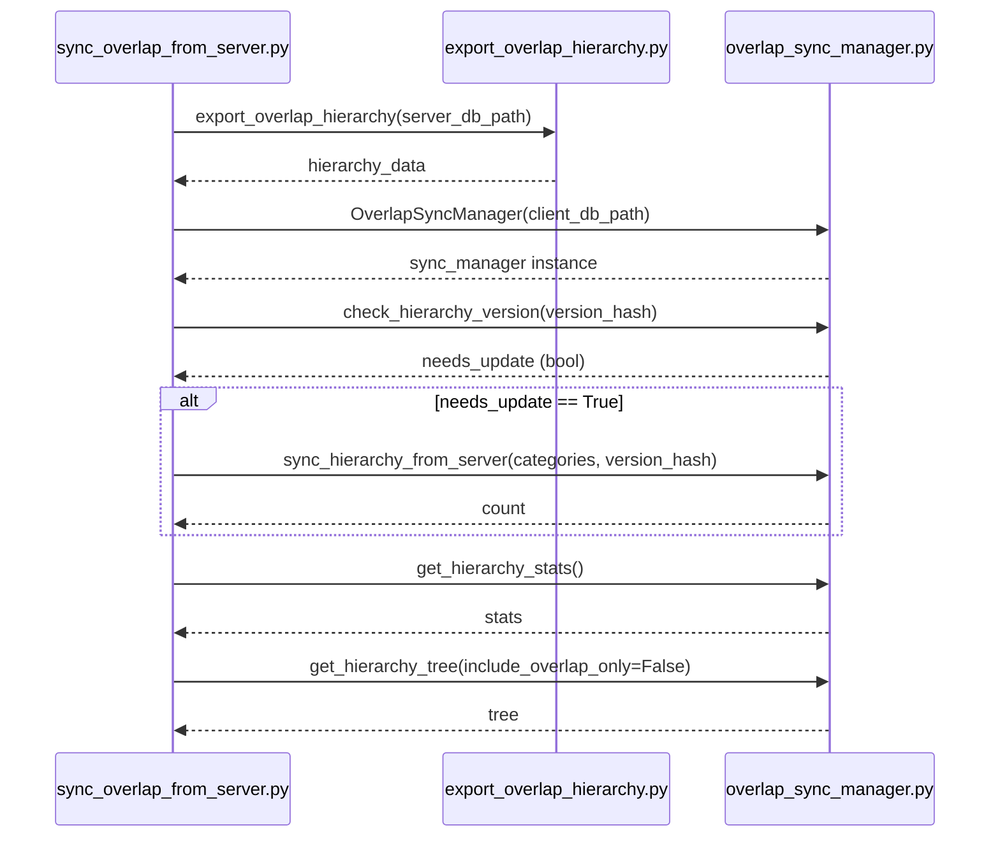

# Ground Truth — sync_overlap_from_server.py — sequenceDiagram

## Metadata
- GT node count: 3 (distinct file participants)
- GT edge count: 6 (outgoing cross-file calls; excludes return arrows)

## Mermaid Diagram

## Actor Definitions
- **A**: Client_Side/utils/sync_overlap_from_server.py
- **B**: Server_Side/db/export_overlap_hierarchy.py (or equivalent — `export_overlap_hierarchy` function)
- **C**: Client_Side/utils/overlap_sync_manager.py

## Message Definitions (outgoing calls only)
1. A → B: `export_overlap_hierarchy(server_db_path)` — direct function call from imported module
2. A → C: `OverlapSyncManager(client_db_path)` — constructor (creates instance)
3. A → C: `check_hierarchy_version(version_hash)` — instance method call on sync_manager
4. A → C: `sync_hierarchy_from_server(categories, version_hash)` — **conditional** (if needs_update)
5. A → C: `get_hierarchy_stats()` — instance method call
6. A → C: `get_hierarchy_tree(include_overlap_only=False)` — instance method call

## Notes
- Calls 3–6 are ALL on a constructed instance (sync_manager = OverlapSyncManager(...)).
  These are the chained-method-call pattern — testing whether skill captures these as cross-file.
- Call 1 (export_overlap_hierarchy) is a DIRECT function import call — expected to be captured.
- 1 significant alt block: if needs_update == True governs call 4.
