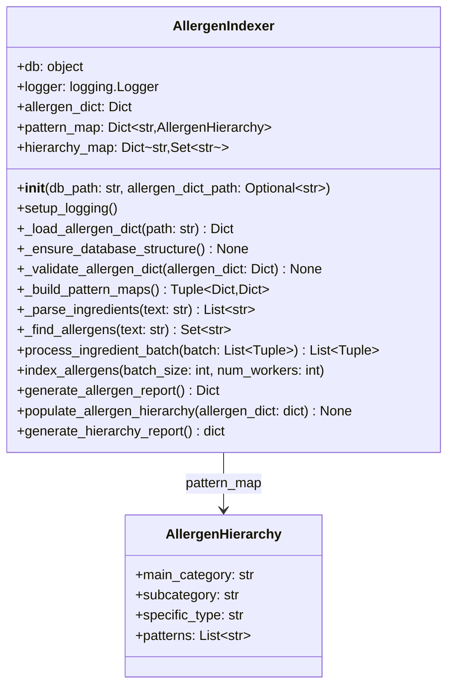

# Skill Output v1 — allergen_indexer.py — classDiagram

## Analysis

**Classes found:** AllergenHierarchy, AllergenIndexer

**Field types analyzed:**
- `AllergenHierarchy`: 4 fields, all built-in types (str, str, str, List[str])
- `AllergenIndexer`: 5 fields:
  - `db`: untyped (external object)
  - `logger`: logging.Logger (external)
  - `allergen_dict: Dict` — built-in
  - `pattern_map: Dict[str, AllergenHierarchy]` — value type is AllergenHierarchy (local class) → EDGE DRAWN
  - `hierarchy_map: Dict[str, Set[str]]` — built-in

**Edges identified:**
- `AllergenIndexer --> AllergenHierarchy` via field `pattern_map: Dict[str, AllergenHierarchy]`
- Reasoning: AllergenHierarchy appears as value type in the generic container annotation

## Diagram

## Notes
- Edge drawn because AllergenHierarchy appears as value type in `Dict[str, AllergenHierarchy]`
- GT drew 0 edges (strict rule: declared field type = Dict, not AllergenHierarchy)
- This exposes a RULE GAP: does `Dict[K, LocalClass]` count as a direct field type reference?
- The GT agent applied strict interpretation; skill applied loose interpretation
