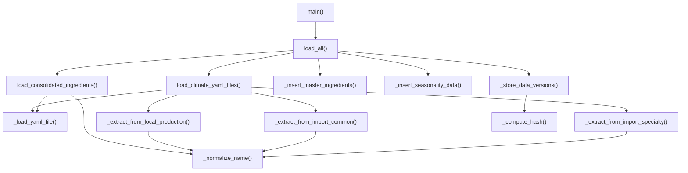

# Skill Output v1 — climate_ingredients_loader.py — flowchart TB

## Analysis

**Entry method:** `load_all()` (main orchestrator); `main()` calls `load_all()` as CLI entry

**Method call relationships found (intra-file, method-level):**
1. main() → load_all()
2. load_all() → load_climate_yaml_files()
3. load_all() → load_consolidated_ingredients()
4. load_all() → _insert_master_ingredients()
5. load_all() → _insert_seasonality_data()
6. load_all() → _store_data_versions()
7. load_climate_yaml_files() → _load_yaml_file()
8. load_climate_yaml_files() → _extract_from_local_production()
9. load_climate_yaml_files() → _extract_from_import_common()
10. load_climate_yaml_files() → _extract_from_import_specialty()
11. load_consolidated_ingredients() → _load_yaml_file()
12. load_consolidated_ingredients() → _normalize_name()
13. _extract_from_local_production() → _normalize_name()
14. _extract_from_import_common() → _normalize_name()
15. _extract_from_import_specialty() → _normalize_name()
16. _store_data_versions() → _compute_hash()

## Diagram

