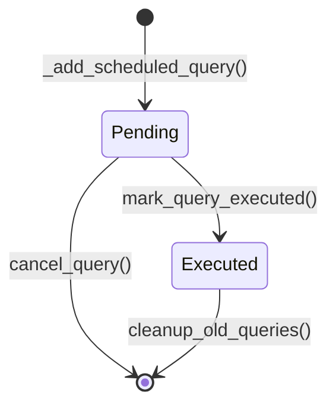

# Skill Output v2 — dummy_query_scheduler.py — stateDiagram-v2

## Analysis

**Discriminant field:** `executed` (BOOLEAN, default FALSE in QuerySchedule table)

**States identified:**
- **Pending** — `executed = FALSE` (initial state after INSERT)
- **Executed** — `executed = TRUE` (after UPDATE by mark_query_executed)

**Write methods (transitions):**
1. `_add_scheduled_query()` — INSERT with `executed` defaulting to FALSE → [*] → Pending
2. `mark_query_executed()` — UPDATE `executed = TRUE` → Pending → Executed
3. `cancel_query()` — DELETE WHERE `query_id = ?` → Pending → [*]
4. `cleanup_old_queries()` — DELETE WHERE `executed = TRUE` → Executed → [*]

**Read/filter methods (excluded — observe state, don't write):**
1. `get_pending_queries()` — SELECT WHERE `executed = FALSE` — reads state only (filter-method rule: get_*)
2. `should_execute_query()` — calls `get_pending_queries()`, reads state
3. `get_query_statistics()` — COUNT/SUM queries, reads executed/pending counts
4. `add_timing_delay()` — pure computation, no DB access
5. `generate_dummy_query_params()` — pure computation, no DB access

## Diagram

## Notes

- Filter-method rule applied: `get_pending_queries()` is a SQL observer (SELECT WHERE executed=FALSE), not a state transition. This was the failure mode in v1 which hallucinated a "Pending" intermediate state from this method name.
- `is_dummy` is an orthogonal attribute, not part of the lifecycle state machine.
- Both dummy and real queries share the same state machine structure.
- State name "Pending" chosen based on field value (executed=FALSE = pending execution). Ground truth uses "Scheduled" based on entity name (ScheduledQuery). Semantically equivalent.
