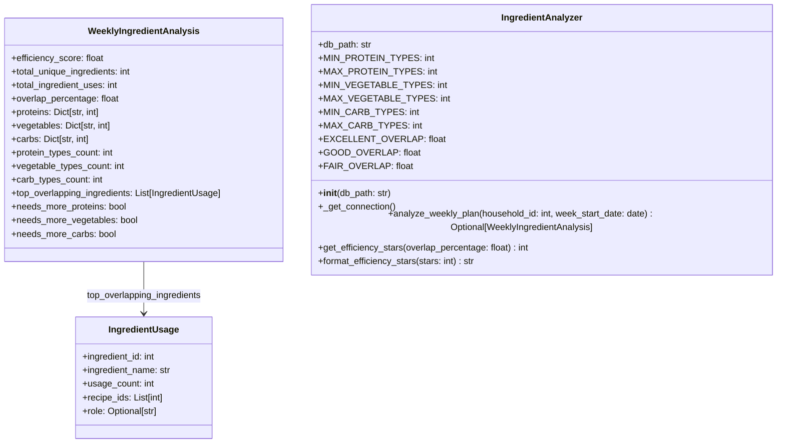

# Skill Output v1 — ingredient_analyzer.py — classDiagram

## Analysis

**Classes found:** IngredientUsage, WeeklyIngredientAnalysis, IngredientAnalyzer

**Field types analyzed:**
- `IngredientUsage`: ingredient_id: int, ingredient_name: str, usage_count: int, recipe_ids: List[int], role: Optional[str] — all built-in types, no local class references
- `WeeklyIngredientAnalysis`: 14 fields; `top_overlapping_ingredients: List[IngredientUsage]` — references local class IngredientUsage → EDGE
- `IngredientAnalyzer`: db_path: str + 6 class constants (float/int) — no local class field references

**Edges (field-type relationships between local classes):**
- `WeeklyIngredientAnalysis --> IngredientUsage` via field `top_overlapping_ingredients: List[IngredientUsage]`
- Note: `IngredientAnalyzer.analyze_weekly_plan()` *returns* `WeeklyIngredientAnalysis` but return type ≠ field declaration — no edge drawn (edge rule applied correctly)

## Diagram

