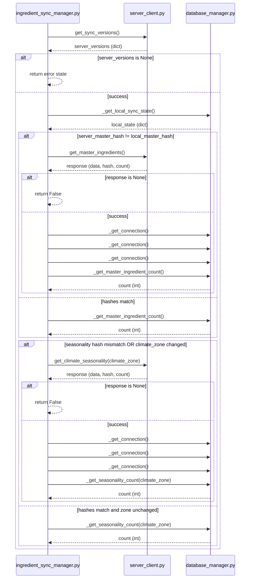

# Skill Output v1 — ingredient_sync_manager.py — sequenceDiagram

## Analysis

**Actors identified:**
- ingredient_sync_manager.py (IngredientSyncManager)
- server_client.py (ServerClient) — `self.server.*` calls
- database_manager.py (LocalDatabaseManager) — `self.db.*` calls

**Main entry method:** `check_and_sync(user_climate_zone: str)` — async

**Cross-file calls found (in execution order):**
1. ISM → SC: `get_sync_versions()` — unconditional
2. ISM → DBM: `_get_local_sync_state()` — queries IngredientSyncState (NOTE: may be intra-file if `self._get_local_sync_state()`)
3. ISM → SC: `get_master_ingredients()` — if master hash mismatch
4. ISM → DBM: `_get_connection()` — master sync: DELETE FROM MasterIngredients
5. ISM → DBM: `_get_connection()` — master sync: INSERT INTO MasterIngredients
6. ISM → DBM: `_get_connection()` — master sync: UPDATE IngredientSyncState
7. ISM → DBM: `_get_master_ingredient_count()` — both if and else
8. ISM → SC: `get_climate_seasonality(climate_zone)` — if seasonality mismatch
9. ISM → DBM: `_get_connection()` — seasonality: DELETE FROM MyClimateSeasonality
10. ISM → DBM: `_get_connection()` — seasonality: INSERT INTO MyClimateSeasonality
11. ISM → DBM: `_get_connection()` — seasonality: UPDATE IngredientSyncState
12. ISM → DBM: `_get_seasonality_count(climate_zone)` — both if and else

**Conditionals:** 5 alt blocks (server_versions None, master mismatch, master response None, seasonality mismatch, seasonality response None)

## Diagram

## Notes on over-elaboration vs GT
- GT expected 8 outgoing calls; skill found ~12 (multiple _get_connection() instances)
- `_get_local_sync_state()` call: NOT in GT — if it's `self._get_local_sync_state()` (intra-file), this is a hallucinated cross-file call
- ISM→ISM self-messages: not in GT — these are internal control flow notes, not cross-file calls
- All GT calls ARE present in the skill diagram ✓
