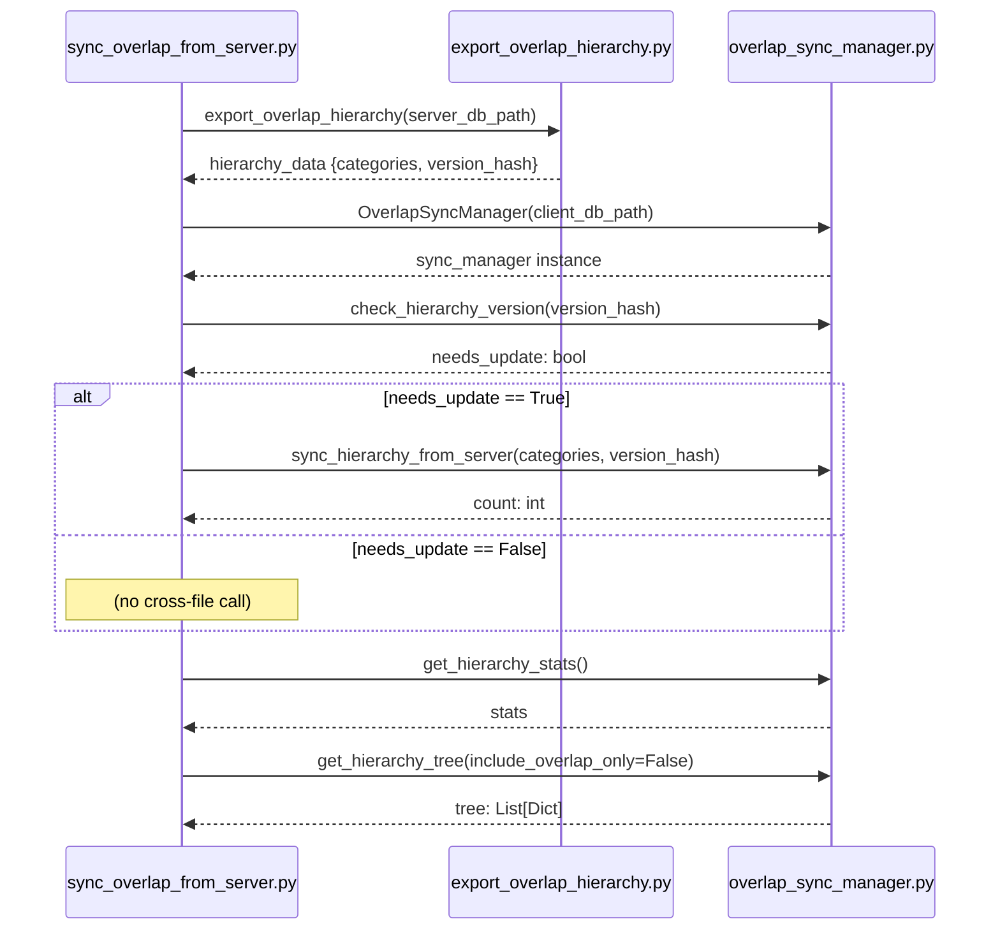

# Skill Output v1 — sync_overlap_from_server.py — sequenceDiagram

## Analysis

**Actors identified:**
- sync_overlap_from_server.py (Client_Side/utils/)
- export_overlap_hierarchy.py (Server_Side/db/)
- overlap_sync_manager.py (Client_Side/utils/)

**Cross-file calls found (in order):**
1. → export_overlap_hierarchy(server_db_path) → returns hierarchy_data dict
2. → OverlapSyncManager(client_db_path) constructor → returns sync_manager instance
3. → check_hierarchy_version(version_hash) → returns needs_update bool
4. [CONDITIONAL if needs_update] → sync_hierarchy_from_server(categories, version_hash) → returns count
5. → get_hierarchy_stats() → returns stats dict
6. → get_hierarchy_tree(include_overlap_only=False) → returns tree list

**Conditionals:** 1 alt block — if needs_update == True governs call 4

## Diagram

## Notes
- All 6 cross-file calls captured — including all 4 instance method calls on constructed sync_manager
- Confirms: chained-method-call gap is a GRAPH PARSER issue, not a skill issue (skill reads source directly)
- Alt block correctly included for conditional sync
