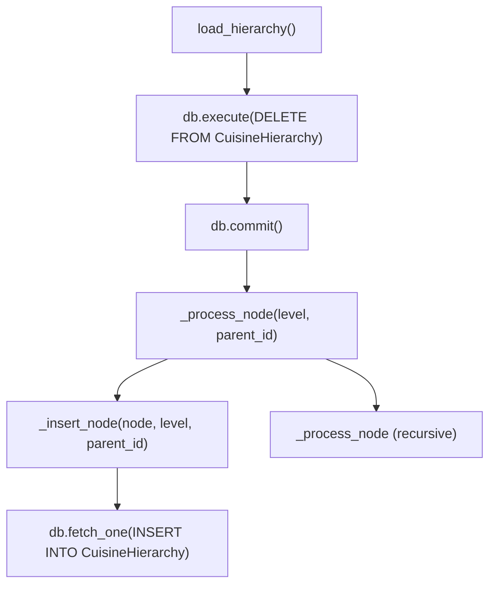

# Ground Truth — cuisine_hierarchy_loader.py — flowchart TB

## Metadata
- GT node count: 7
- GT edge count: 7

## Mermaid Diagram

## Node Definitions
- **load_hierarchy()**: Entry point; clears table then iterates root nodes
- **db.execute(DELETE)**: Cross-file terminal: clears existing CuisineHierarchy records
- **db.commit()**: Cross-file terminal: commits the DELETE transaction
- **_process_node()**: Recursive dispatcher; checks style filter, calls _insert_node, recurses into children
- **_insert_node()**: Inserts one node; builds materialized path; calls db.fetch_one()
- **db.fetch_one(INSERT)**: Cross-file terminal: INSERT INTO CuisineHierarchy with RETURNING id
- **_process_node (recursive)**: Recursive call to _process_node for each child node

## Notes
- GT granularity: method-level. SQL statement content not shown as separate nodes.
- Cross-file DB calls (db.execute, db.commit, db.fetch_one) are terminal leaf nodes.
- __init__ → _load_data is an initialization chain separate from the main load_hierarchy() pipeline. Excluded from GT as it precedes the entry point.
- generate_report() is a secondary utility — excluded from main pipeline GT.
- Edge count discrepancy note: the GT agent said 8 but the diagram has 7 arrows. Using 7 as the authoritative count.
