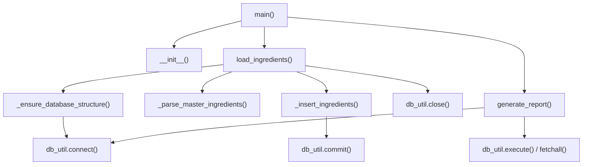

# Ground Truth — master_ingredients_loader.py — flowchart TB

## Metadata
- GT node count: 11
- GT edge count: 10

## Mermaid Diagram

## Node Definitions
- **main()**: CLI entry; instantiates loader, calls load_ingredients() then generate_report()
- **__init__()**: Constructor; loads YAML hierarchy file, sets up logging, initializes state
- **load_ingredients()**: Primary pipeline; orchestrates ensure_db → parse → insert → close
- **_ensure_database_structure()**: Verifies MasterIngredients table exists via db_util.connect()
- **_parse_master_ingredients()**: Reads hierarchy data, extracts ingredient terms
- **_insert_ingredients()**: Batch inserts ingredients; calls db_util.commit()
- **db_util.close()**: Cross-file: closes database connection (finally block)
- **generate_report()**: Post-load stats; calls db_util.connect() and db_util.execute()/fetchall()
- **db_util.connect()**: Cross-file terminal: database connection from db_factory module
- **db_util.execute() / fetchall()**: Cross-file terminal: DB query execution
- **db_util.commit()**: Cross-file terminal: DB transaction commit

## Notes
- GT granularity: method-level only. No statement-level SQL or loop nodes.
- Cross-file DB calls (db_util.*) are terminal leaf nodes — they are methods on the db_factory database object.
- `_extract_ingredients_from_category()` is defined but appears to be unused/dead code in the current implementation. Excluded from GT per method-level rule.
- The `init --> load` edge present in some analyses reflects the YAML loading in __init__, not a call to load_ingredients(). Excluded here for clarity.
