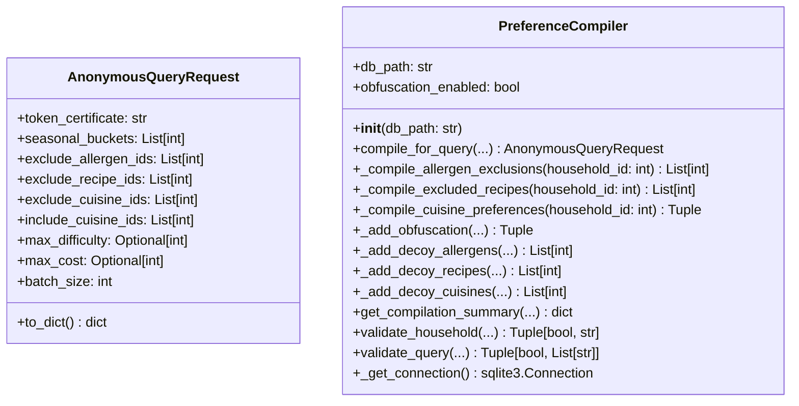

# Ground Truth — preference_compiler.py — classDiagram

## Metadata
- GT node count: 2
- GT edge count: 0

## Mermaid Diagram

## Class Definitions

**AnonymousQueryRequest** (dataclass): Represents an anonymous server query. All fields are primitives or standard library containers: `token_certificate: str`, `seasonal_buckets: List[int]`, `exclude_allergen_ids: List[int]`, `exclude_recipe_ids: List[int]`, `exclude_cuisine_ids: List[int]`, `include_cuisine_ids: List[int]`, `max_difficulty: Optional[int]`, `max_cost: Optional[int]`, `batch_size: int`.

**PreferenceCompiler**: Compiles household preferences into anonymous queries. Instance fields set in `__init__`: `db_path: str`, `obfuscation_enabled: bool`. No field of type `AnonymousQueryRequest`.

## Edge Definitions

**None.**

- AnonymousQueryRequest fields: all primitive types (str, int) or generic containers of primitives (List[int], Optional[int]) — no local class references.
- PreferenceCompiler fields: only `db_path: str` and `obfuscation_enabled: bool` — primitives.
- `compile_for_query()` returns `AnonymousQueryRequest`, but return types are NOT field declarations — edges are not drawn from method signatures.
