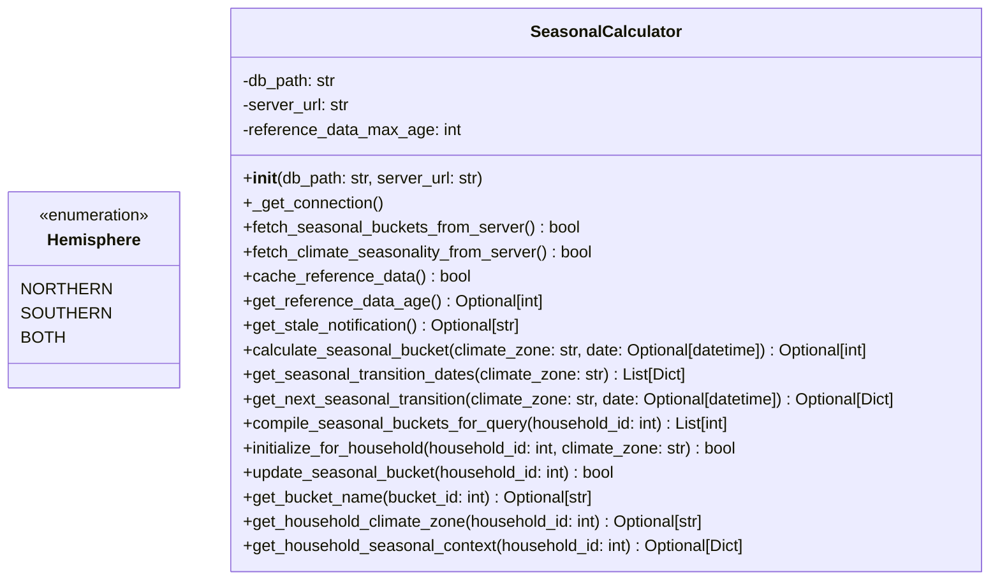

# Ground Truth — seasonal_calculator.py — classDiagram

## Metadata
- GT node count: 2
- GT edge count: 0

## Mermaid Diagram

## Class Definitions

**Hemisphere** (Enum): Three members — NORTHERN ("northern"), SOUTHERN ("southern"), BOTH ("both"). No locally-defined class fields.

**SeasonalCalculator**: Instance fields in `__init__`: `db_path: str`, `server_url: str`, `reference_data_max_age: int` (all primitives). The `Hemisphere` enum is defined in this file but never used as a declared field type.

## Edge Definitions

**None.**

- Hemisphere enum members have primitive string values — no local class references.
- SeasonalCalculator instance fields are all primitive types (str, int).
- `Hemisphere` is never used as a declared field type in SeasonalCalculator (only as a method annotation type if at all).
- No edges drawn: edge rule requires a field whose declared type IS the local class, not merely a related class used in methods.
