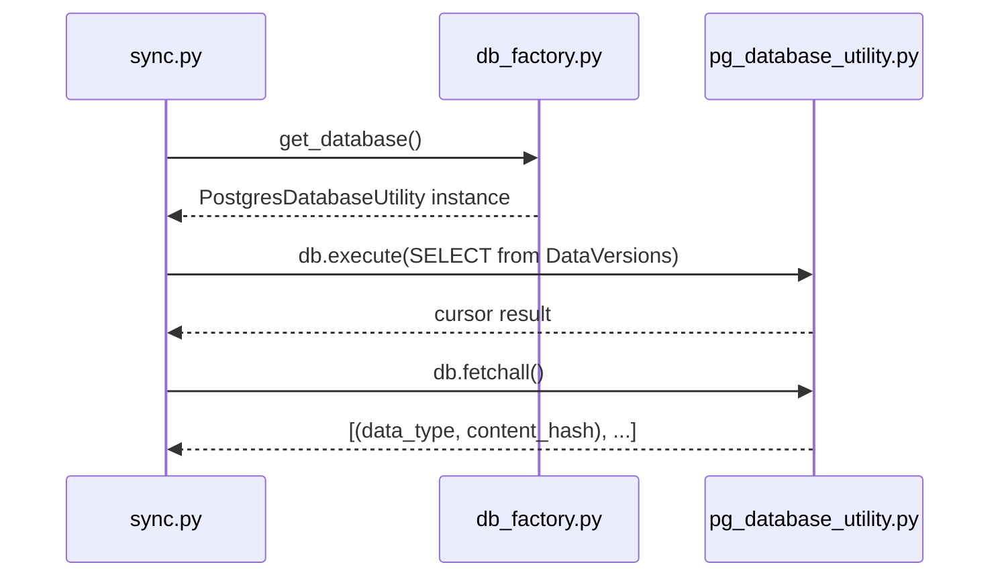

# Ground Truth — sync.py — sequenceDiagram

## Metadata
- GT node count: 3 (file-level actors: sync.py, db_factory.py, pg_database_utility.py)
- GT edge count: 3 (runtime cross-file calls; excluding module-level import of DB_TYPE)

## Mermaid Diagram

## Actor Definitions
- **sync**: Server_Side/api/routes/sync.py — entry point file
- **factory**: Server_Side/db/db_factory.py — provides get_database() factory function
- **pgutil**: Server_Side/db/pg_database_utility.py — PostgresDatabaseUtility class with execute/fetchall

## Message Definitions
1. sync → factory: `get_database()` — runtime call at line 60
2. sync → pgutil: `db.execute(SELECT...)` — query DataVersions table at line 69
3. sync → pgutil: `db.fetchall()` — retrieve results at line 77

## Notes
- DB_TYPE is a module-level constant import from config.py, not a runtime call — excluded
- Actors are Python source files ONLY. FastAPI client and PostgreSQL database server are NOT actors.
- db.close() appears in an exception handler — excluded (not on the main execution path)
- pg_database_utility's internal implementation (how it talks to PostgreSQL) is NOT shown — we show only sync.py's perspective
