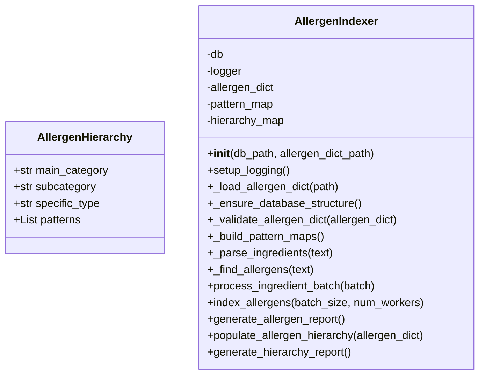

# Skill Output v2 — allergen_indexer.py — classDiagram

## Analysis

**Classes found:** AllergenHierarchy (dataclass), AllergenIndexer

**Field types analyzed:**
- AllergenHierarchy: main_category: str → NO EDGE (primitive type, not a local class)
- AllergenHierarchy: subcategory: str → NO EDGE (primitive type, not a local class)
- AllergenHierarchy: specific_type: str → NO EDGE (primitive type, not a local class)
- AllergenHierarchy: patterns: List[str] → NO EDGE (declared type is List; str is only a type parameter)
- AllergenIndexer: db: (inferred, no annotation) → NO EDGE (no declared type annotation)
- AllergenIndexer: logger: (inferred, no annotation) → NO EDGE (no declared type annotation)
- AllergenIndexer: allergen_dict: Dict → NO EDGE (declared type is Dict; not a local class)
- AllergenIndexer: pattern_map: Dict[str, AllergenHierarchy] → NO EDGE (AllergenHierarchy is only a type parameter, not the declared field type itself; declared type is Dict)
- AllergenIndexer: hierarchy_map: Dict[str, Set[str]] → NO EDGE (no local classes; only str and Set used)

**Edges identified:**
None

## Diagram

## Notes

**v2 fix applied — Generic container type rule:**

v1 incorrectly drew `AllergenIndexer --> AllergenHierarchy` because `pattern_map: Dict[str, AllergenHierarchy]` has AllergenHierarchy as a type parameter.

v2 correctly applies: the declared type of `pattern_map` is `Dict` (a generic container). `AllergenHierarchy` appears only as the value type parameter `V` in `Dict[K, V]`. Per the generic container rule, the CONTAINER is the declared type — do NOT draw edges for type parameters. Result: 0 edges.
