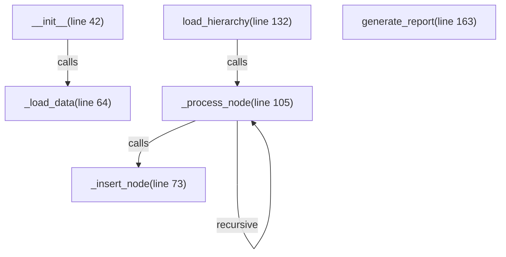

# Skill Output v1 — cuisine_hierarchy_loader.py — flowchart TB

## Analysis

**Entry points:** __init__() (line 42), load_hierarchy() (line 132)

**Call chain (method-level):**
1. __init__ → _load_data (reads JSON from disk)
2. load_hierarchy → _process_node (iterates root continents)
3. _process_node → _insert_node (inserts current node to DB)
4. _process_node → _process_node (recursive, for each child)

**Nodes identified:** 6 (including generate_report with no edges)
**Edges identified:** 4

## Diagram

## Notes
- Method-level granularity applied
- Cross-file DB calls (db.execute, db.commit, db.fetch_one) were NOT shown — they are calls on the db object from db_factory, but were not included
- DB terminal nodes are the key gap vs GT: GT shows db.execute(DELETE), db.commit(), db.fetch_one(INSERT) as terminal nodes
- Root cause: skill agent prompt did not explicitly instruct to show cross-file db method calls as terminal nodes
