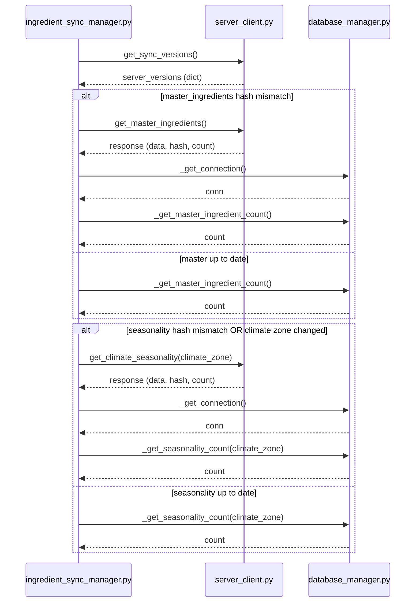

# Skill Output v2 — ingredient_sync_manager.py — sequenceDiagram

## Analysis

**Actors:** ISM (ingredient_sync_manager.py), SC (server_client.py), DBM (database_manager.py)

**Cross-file calls (in order):**
1. check_and_sync() → self.server.get_sync_versions() [ISM→SC]
2. _sync_master_ingredients() → self.server.get_master_ingredients() [ISM→SC, if hash mismatch]
3. _sync_master_ingredients() → self.db._get_connection() [ISM→DBM, write master ingredients - one compressed call]
4. _get_master_ingredient_count() → self.db._get_connection() [ISM→DBM, count SELECT, in both alt branches]
5. _sync_seasonality() → self.server.get_climate_seasonality(climate_zone) [ISM→SC, if seasonality mismatch]
6. _sync_seasonality() → self.db._get_connection() [ISM→DBM, write seasonality - one compressed call]
7. _get_seasonality_count() → self.db._get_connection() [ISM→DBM, count SELECT, in both alt branches]

**Excluded:**
- _get_local_sync_state(): intra-file state management, excluded entirely — its internal _get_connection() is not a top-level cross-file message
- All cursor operations (conn.cursor, cursor.execute, conn.commit, conn.close): intra-file operations on caller-owned connection object
- All ISM→ISM self-messages: ZERO self-calls, FORBIDDEN

## Diagram

## Notes

**v2 fixes applied:**

1. **No self-messages**: Zero ISM→ISM arrows. v1 had `ISM-->>ISM: return error state` and `ISM-->>ISM: return False` in nested alt blocks — all removed.

2. **No _get_local_sync_state**: v1 showed `ISM→DB: _get_local_sync_state()` as a cross-file call. It is actually `self._get_local_sync_state()` — a private method defined in ingredient_sync_manager.py (intra-file). Excluded entirely.

3. **Collapsed _get_connection calls**: v1 showed 3 separate `_get_connection()` calls per conditional block (for DELETE, INSERT, UPDATE). v2 shows ONE representative `_get_connection()` per write block.

4. **Count methods labeled semantically**: `_get_master_ingredient_count()` and `_get_seasonality_count()` are shown as the semantic label for the count DB interaction, placed correctly inside both alt branches.
