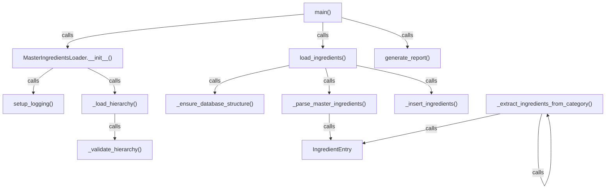

# Skill Output v1 — master_ingredients_loader.py — flowchart TB

## Analysis

**Entry point:** `main()` (line 418)

**Call chain (method-level):**
1. main → MasterIngredientsLoader.__init__
2. __init__ → setup_logging
3. __init__ → _load_hierarchy
4. _load_hierarchy → _validate_hierarchy
5. main → load_ingredients
6. load_ingredients → _ensure_database_structure
7. load_ingredients → _parse_master_ingredients
8. _parse_master_ingredients → IngredientEntry (constructor)
9. load_ingredients → _insert_ingredients
10. _extract_ingredients_from_category → IngredientEntry (constructor)
11. _extract_ingredients_from_category → _extract_ingredients_from_category (recursive)
12. main → generate_report

**Nodes identified:** 12
**Edges identified:** 12

## Diagram

## Notes
- Method-level granularity applied
- Cross-file DB calls (db_util.connect, db_util.commit, db_util.execute) were NOT captured in graph sub-JSON and therefore not shown
- setup_logging, _load_hierarchy, _validate_hierarchy captured from graph call edges
- _extract_ingredients_from_category captured from graph; GT agent considered it dead code — discrepancy
