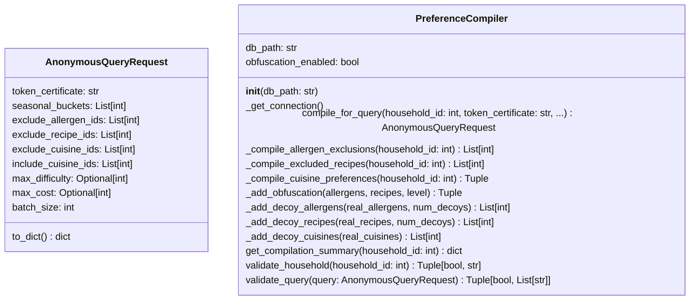

# Skill Output v1 — preference_compiler.py — classDiagram

## Analysis

**Classes found:** AnonymousQueryRequest (dataclass), PreferenceCompiler

**Field types analyzed:**
- AnonymousQueryRequest: token_certificate: str → NO EDGE (primitive)
- AnonymousQueryRequest: seasonal_buckets: List[int] → NO EDGE (declared type is List; int is type param)
- AnonymousQueryRequest: exclude_allergen_ids: List[int] → NO EDGE (declared type is List)
- AnonymousQueryRequest: exclude_recipe_ids: List[int] → NO EDGE (declared type is List)
- AnonymousQueryRequest: exclude_cuisine_ids: List[int] → NO EDGE (declared type is List)
- AnonymousQueryRequest: include_cuisine_ids: List[int] → NO EDGE (declared type is List)
- AnonymousQueryRequest: max_difficulty: Optional[int] → NO EDGE (Optional[int]; int is not a local class)
- AnonymousQueryRequest: max_cost: Optional[int] → NO EDGE (Optional[int]; int is not a local class)
- AnonymousQueryRequest: batch_size: int → NO EDGE (primitive)
- PreferenceCompiler: db_path: str → NO EDGE (primitive)
- PreferenceCompiler: obfuscation_enabled: bool → NO EDGE (primitive)

**Edges identified:**
None. No instance field in either class has a declared type that is a locally-defined class. The graph shows `produces`/`consumes` edges to AnonymousQueryRequest from method signatures, but those are not field-type edges.

## Diagram

## Notes
- No inter-class edges: PreferenceCompiler's only instance fields are `db_path: str` and `obfuscation_enabled: bool`
- `compile_for_query()` returns AnonymousQueryRequest (method signature), but edge rule excludes return types
- Generic container rule not triggered: no type parameters of local classes found in field declarations
