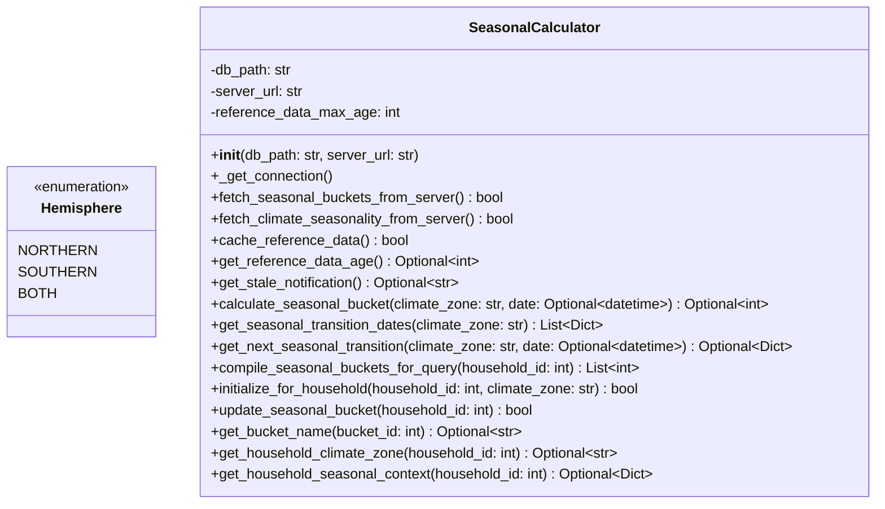

# Skill Output v1 — seasonal_calculator.py — classDiagram

## Analysis

**Classes found:** Hemisphere (Enum), SeasonalCalculator

**Field types analyzed:**
- Hemisphere: NORTHERN (str value) → NO EDGE (enum member, not a field type reference)
- Hemisphere: SOUTHERN (str value) → NO EDGE
- Hemisphere: BOTH (str value) → NO EDGE
- SeasonalCalculator: db_path: str → NO EDGE (primitive)
- SeasonalCalculator: server_url: str → NO EDGE (primitive)
- SeasonalCalculator: reference_data_max_age: int → NO EDGE (primitive)

**Edges identified:**
None. SeasonalCalculator has only primitive instance fields. The Hemisphere enum exists in the file but is not used as a declared field type in SeasonalCalculator. No local class appears as a top-level declared field type in any class.

## Diagram

## Notes
- Hemisphere enum present but never referenced as a field type
- SeasonalCalculator is a stateless handler (all DB state retrieved via SQL; no local class instances stored as fields)
- 0-edge result is consistent with the file having two unrelated types (Enum + service class)
