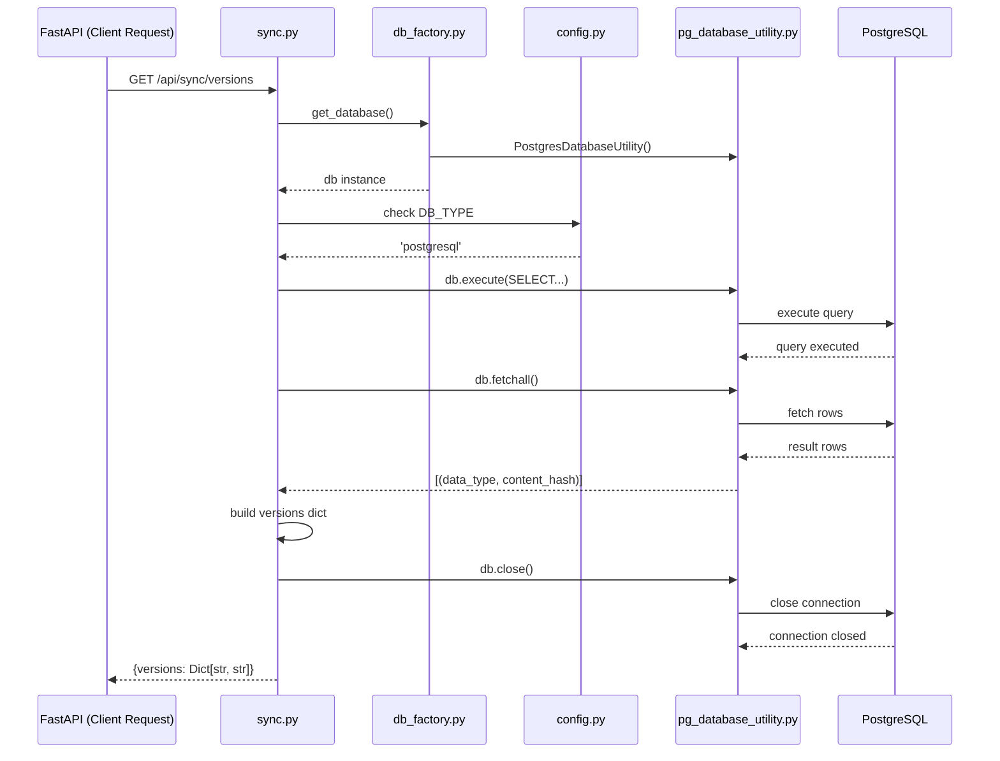

# Skill Output v1 — sync.py — sequenceDiagram

## Analysis

**Actors identified:**
- FastAPI Client (external — NOT a Python file)
- sync.py (Server_Side/api/routes/sync.py)
- db_factory.py (Server_Side/db/db_factory.py)
- config.py (Server_Side/db/config.py)
- pg_database_utility.py (Server_Side/db/pg_database_utility.py)
- PostgreSQL DB (external — NOT a Python file)

**Entry point:** get_data_versions() (async FastAPI route)

**Cross-file calls (in order):**
1. sync → db_factory: get_database()
2. sync → config: check DB_TYPE
3. sync → pg_database_utility: db.execute()
4. sync → pg_database_utility: db.fetchall()
5. sync → pg_database_utility: db.close()

**Excluded:** only intra-file operations (variable assignments, dict building)

## Diagram

## Notes
- Added FastAPI Client and PostgreSQL Database as actors — these are NOT Python source files (gap identified)
- Showed internal implementation of PgUtil (PgUtil→Database arrows) — should only show sync.py's perspective
- SyncRoute→SyncRoute: build versions dict = self-message (forbidden)
- db.close() shown as main-path call but GT excludes it (only in exception handler)
- Root cause of failures: actors include non-file external systems; internal library traversal shown
