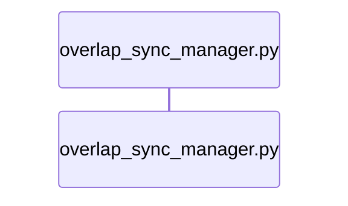

# Ground Truth — overlap_sync_manager.py — sequenceDiagram

## Metadata
- GT node count (actors): 1
- GT edge count (active messages): 0

## Mermaid Diagram

## Notes
- DEGENERATE CASE: overlap_sync_manager.py uses only stdlib (sqlite3, hashlib, json) — no cross-file calls to other project Python files.
- Actors = Python .py source files only. sqlite3 is stdlib → NOT an actor.
- The correct diagram for this file has 1 actor (itself) and 0 messages.
- Diagram type (sequenceDiagram) is INAPPROPRIATE for this entry point — it has no cross-file call structure.
- A classDiagram would be more appropriate (it has 1 class: OverlapSyncManager with multiple methods).
