# Ground Truth — populate_reference_data.py — flowchart TB

## Metadata
- GT node count: 45 (agent-reported; includes per-call-site terminal nodes)
- GT edge count: 48 (agent-reported)

## Mermaid Diagram

```mermaid
flowchart TB
    A["populate_all_reference_data()"]
    B["populate_geographic_hierarchy_from_json()"]
    D["insert_hierarchy_records()"]
    E["sqlite3.connect()"]
    F["cursor.executemany()"]
    G["conn.commit()"]
    H["conn.close()"]

    I["populate_allergen_hierarchy_from_json()"]
    K["insert_allergen_records()"]
    L["sqlite3.connect()"]
    M["cursor.executemany()"]
    N["conn.commit()"]
    O["conn.close()"]

    P["populate_diet_types_from_json()"]
    R["sqlite3.connect()"]
    S["cursor.execute()"]
    T["conn.commit()"]
    U["conn.close()"]

    V["populate_equipment_types_from_json()"]
    X["sqlite3.connect()"]
    Y["cursor.execute()"]
    Z["conn.commit()"]
    AA["conn.close()"]

    AB["populate_storage_types_from_json()"]
    AD["sqlite3.connect()"]
    AE["cursor.execute()"]
    AF["conn.commit()"]
    AG["conn.close()"]

    AH["populate_climate_seasonality()"]
    AI["sqlite3.connect()"]
    AJ["cursor.execute()"]
    AK["_insert_climate_bucket_ranges()"]
    AL["cursor.execute()"]
    AM["conn.commit()"]
    AN["conn.rollback()"]
    AO["conn.close()"]

    A --> B
    A --> I
    A --> P
    A --> V
    A --> AB
    A --> AH

    B --> D
    D --> E
    D --> F
    D --> G
    D --> H

    I --> K
    K --> L
    K --> M
    K --> N
    K --> O

    P --> R
    P --> S
    P --> T
    P --> U

    V --> X
    V --> Y
    V --> Z
    V --> AA

    AB --> AD
    AB --> AE
    AB --> AF
    AB --> AG

    AH --> AI
    AH --> AJ
    AH --> AK
    AK --> AL
    AH --> AM
    AH --> AN
    AH --> AO
```

## Notes
- File uses sqlite3 directly (not a project DB utility wrapper) — sqlite3.connect, cursor.execute, conn.commit etc. ARE cross-file terminal nodes
- GT agent created per-call-site nodes (separate sqlite3.connect node for each function) — this creates duplicated terminal node labels
- json.load omitted from corrected GT — file I/O (json, open, pathlib) are NOT cross-file terminal nodes per calibration rule
- Shared-node approach (one sqlite3.connect() pointed to by all callers) is also acceptable granularity
