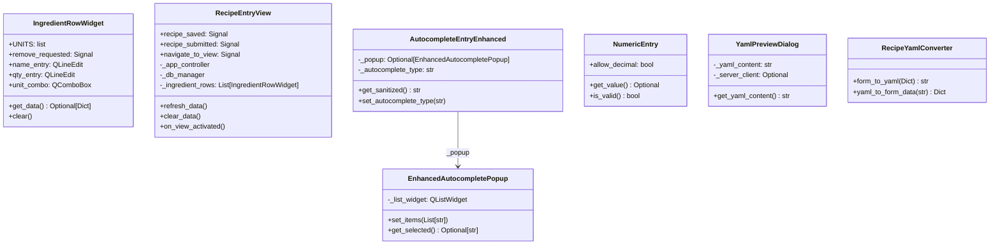

# Ground Truth — recipe_entry_view.py — classDiagram

## Metadata
- GT node count: 7
- GT edge count: 1

## Mermaid Diagram

## Actor Definitions
- **IngredientRowWidget** — row widget in recipe_entry_view.py
- **RecipeEntryView** — main view class in recipe_entry_view.py
- **AutocompleteEntryEnhanced** — imported from ui_new/components/autocomplete_entry.py
- **EnhancedAutocompletePopup** — imported from same file as AutocompleteEntryEnhanced
- **NumericEntry** — imported from ui_new/components/numeric_entry.py
- **YamlPreviewDialog** — imported from ui_new/dialogs/yaml_preview_dialog.py
- **RecipeYamlConverter** — imported from utils/recipe_yaml_converter.py

## Notes
- 1 structural edge: AutocompleteEntryEnhanced → EnhancedAutocompletePopup via `_popup: Optional[EnhancedAutocompletePopup]`
- RecipeEntryView._ingredient_rows: List[IngredientRowWidget] → NO edge (container type rule)
- Classes from imported project files ARE included in classDiagram (this is a multi-file diagram)
- GT agent read imported files to find classes used as field types across the file boundary
