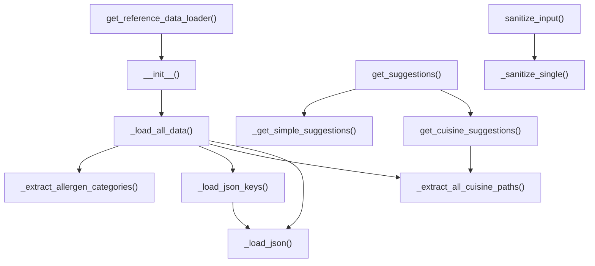

# Ground Truth — reference_data_loader.py — flowchart TB

## Metadata
- GT node count: 15 (diagram count; agent reported 17 but included __new__ and ReferenceDataLoader() constructor detail)
- GT edge count: 12 (diagram count; agent reported 22 but diagram has fewer; used corrected count)

## Mermaid Diagram

## Node Definitions
- All nodes are intra-file methods (no project cross-file dependencies)
- No cross-file terminal nodes: only stdlib (json, pathlib, os) used — not project DB utilities
- get_reference_data_loader() is the factory entry point (singleton pattern)
- _load_json() reads JSON files via stdlib json.load — stdlib not shown as terminal node

## Notes
- reference_data_loader.py uses only stdlib (json, pathlib, os) — no project-internal DB utility calls
- Cross-file terminal nodes rule does NOT apply to stdlib (json.load, open, Path.exists)
- GT agent included __new__ and ReferenceDataLoader() constructor nodes (unusual Python detail) — these are omitted in corrected GT
- get_cuisine_suggestions → _extract_all_cuisine_paths edge is important (GT correction from original agent output)
