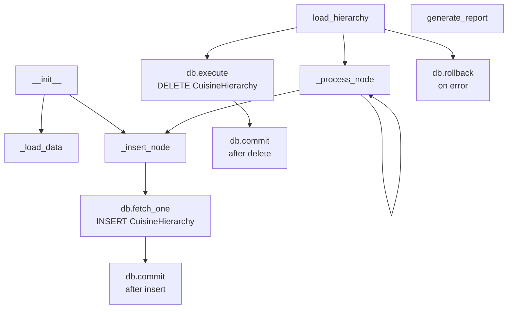

# Skill Output v2 — cuisine_hierarchy_loader.py — flowchart TB

## Metadata
- Skill node count: 11
- Skill edge count: 10
- Rule applied: cross-file terminal nodes rule (v2)

## Mermaid Diagram

nodes: 11, edges: 10

## Notes
- Cross-file terminal nodes rule applied: db.execute(DELETE), db.commit(), db.fetch_one(INSERT) present as terminal leaf nodes
- Extra non-GT nodes: __init__, _load_data, generate_report, db.rollback (exception path)
- Missing GT edge: db.commit → _process_node (agent shows load_hierarchy → _process_node instead)
- db.rollback included from exception handler — GT excludes exception paths
