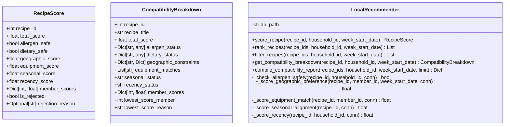

# Skill Output v1 — local_recommender.py — classDiagram

## Metadata
- Skill node count: 3
- Skill edge count: 0

## Mermaid Diagram

```mermaid
classDiagram
    class RecipeScore {
        +int recipe_id
        +float total_score
        +bool allergen_safe
        +bool dietary_safe
        +float geographic_score
        +float equipment_score
        +float seasonal_score
        +float recency_score
        +Dict[int, float] member_scores
        +bool is_rejected
        +Optional[str] rejection_reason
    }

    class CompatibilityBreakdown {
        +int recipe_id
        +str recipe_title
        +float total_score
        +Dict[str, any] allergen_status
        +Dict[str, any] dietary_status
        +Dict[str, Dict] geographic_constraints
        +List[str] equipment_matches
        +str seasonal_status
        +str recency_status
        +Dict[int, float] member_scores
        +int lowest_score_member
        +str lowest_score_reason
    }

    class LocalRecommender {
        -str db_path
        +score_recipe(recipe_id, household_id, week_start_date) RecipeScore
        +rank_recipes(recipe_ids, household_id, week_start_date) List
        +filter_recipes(recipe_ids, household_id, week_start_date) List
        +get_compatibility_breakdown(recipe_id, household_id, week_start_date) CompatibilityBreakdown
        +compile_compatibility_report(recipe_ids, household_id, week_start_date, limit) Dict
        -_check_allergen_safety(recipe_id, household_id, conn) bool
        -_score_geographic_preference(recipe_id, member_id, week_start_date, conn) float
        -_score_equipment_match(recipe_id, member_id, conn) float
        -_score_seasonal_alignment(recipe_id, conn) float
        -_score_recency(recipe_id, household_id, conn) float
    }
```

Skill nodes: 3
Skill edges: 0
