# Skill Output v2 — master_ingredients_loader.py — flowchart TB

## Metadata
- Skill node count: 32
- Skill edge count: 52
- Rule applied: cross-file terminal nodes rule (v2)

## Mermaid Diagram

```mermaid
graph TB
    main["main()"]
    init["__init__()"]
    setup_logging["setup_logging()"]
    load_h["_load_hierarchy()"]
    validate["_validate_hierarchy()"]
    ensure_db["_ensure_database_structure()"]
    extract_cat["_extract_ingredients_from_category()"]
    parse_ing["_parse_master_ingredients()"]
    insert_ing["_insert_ingredients()"]
    load_ing["load_ingredients()"]
    gen_report["generate_report()"]

    get_db["get_database()"]
    get_ph["get_placeholder()"]
    db_connect1["db_util.connect()"]
    db_execute1["db_util.execute()"]
    db_fetchone1["db_util.fetchone()"]
    db_table_exists["db_util.table_exists()"]
    db_execute2["db_util.execute()"]
    db_rowcount["db_util.cursor.rowcount"]
    db_rollback["db_util.rollback()"]
    db_commit1["db_util.commit()"]
    db_execute3["db_util.execute()"]
    db_commit2["db_util.commit()"]
    db_close["db_util.close()"]
    db_connect2["db_util.connect()"]
    db_execute4["db_util.execute()"]
    db_fetchall1["db_util.fetchall()"]
    db_fetchone2["db_util.fetchone()"]
    db_execute5["db_util.execute()"]
    db_fetchall2["db_util.fetchall()"]
    db_fetch_one["db_util.fetch_one()"]
    db_fetch_all1["db_util.fetch_all()"]
    db_fetch_all2["db_util.fetch_all()"]

    main --> init
    main --> load_ing
    main --> gen_report

    init --> get_db
    init --> setup_logging
    init --> load_h

    load_h --> validate

    ensure_db --> db_connect1
    ensure_db --> db_execute1
    ensure_db --> db_fetchone1
    ensure_db --> db_table_exists

    extract_cat --> extract_cat

    parse_ing --> parse_ing

    insert_ing --> get_ph
    insert_ing --> db_execute2
    insert_ing --> db_rowcount
    insert_ing --> db_rollback
    insert_ing --> db_commit1

    load_ing --> ensure_db
    load_ing --> db_execute3
    load_ing --> db_commit2
    load_ing --> parse_ing
    load_ing --> insert_ing
    load_ing --> db_close

    gen_report --> db_connect2
    gen_report --> db_execute4
    gen_report --> db_fetchall1
    gen_report --> db_execute5
    gen_report --> db_fetchall2
    gen_report --> db_fetchone2
    gen_report --> db_fetch_one
    gen_report --> db_fetch_all1
    gen_report --> db_fetch_all2
    gen_report --> db_close
```

nodes: 32, edges: 52

## Notes
- Cross-file terminal nodes rule applied: all db_util.* calls included as terminal leaf nodes
- Over-elaboration issue: duplicate DB call nodes (db_execute1..5, db_connect1..2, etc.) inflates counts
- Extra non-GT methods included: setup_logging, _load_hierarchy, _validate_hierarchy, _extract_ingredients_from_category
