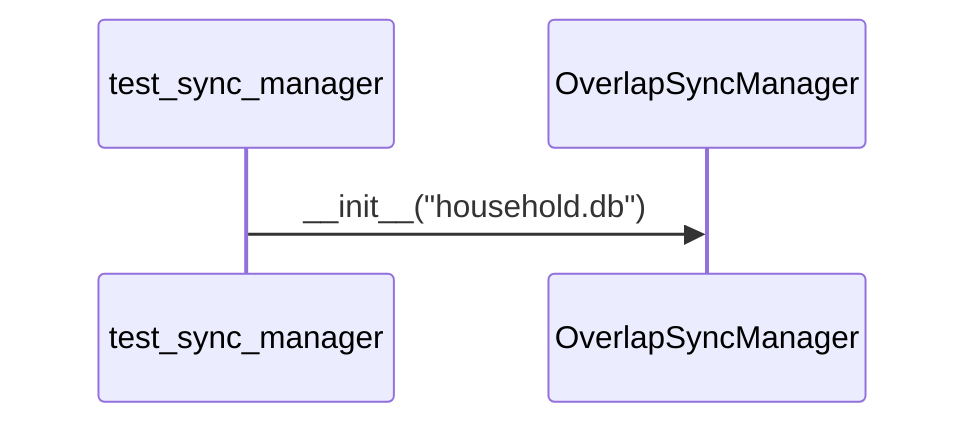

# Skill Output v1 — overlap_sync_manager.py — sequenceDiagram

## Metadata
- Skill actor count: 2 (hallucinated extra test actor)
- Skill message count: 1 (hallucinated)

## Mermaid Diagram

Skill actors: 2
Skill messages: 1

## Notes
- DEGENERATE CASE — overlap_sync_manager.py has no cross-file calls to other project Python files
- Skill agent correctly identified no cross-file project calls, but then hallucinated a test caller
- Should have produced 1 actor (overlap_sync_manager.py) and 0 messages
- Root cause: skill prompt doesn't explain how to handle the degenerate case (no cross-file calls)
- Wrong diagram type selection: sequenceDiagram requires cross-file call structure; this file only uses sqlite3 (stdlib)
