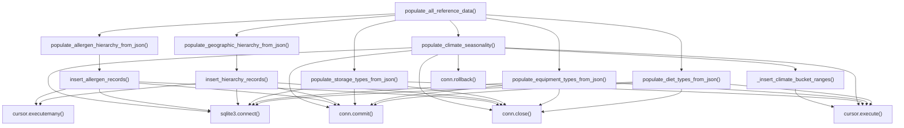

# Skill Output v1 — populate_reference_data.py — flowchart TB

## Metadata
- Skill node count: 16
- Skill edge count: 35 (diagram count)

## Mermaid Diagram

Skill nodes: 16, Skill edges: 35

## Notes
- Skill correctly applied shared terminal node pattern (one sqlite3.connect() for all callers)
- json.load correctly excluded (file I/O is not a cross-file terminal node)
- GT had 45 nodes with per-call-site duplication (sqlite3.connect × 6, cursor.execute × 5, etc.)
- Skill's 16 nodes cover 40/45 GT node concepts via shared nodes
- json.load nodes in GT (5 instances) are not covered by skill — but may be a GT calibration error
