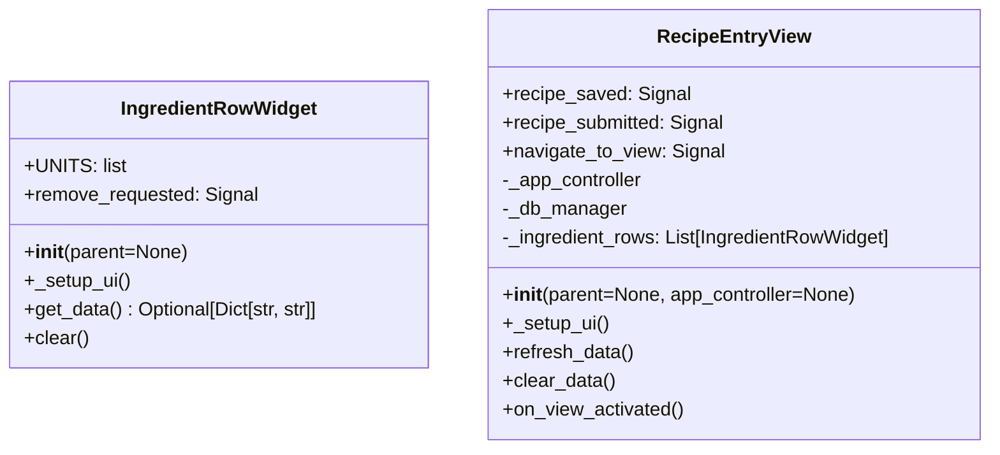

# Skill Output v1 — recipe_entry_view.py — classDiagram

## Metadata
- Skill node count: 2
- Skill edge count: 0

## Mermaid Diagram

Skill nodes: 2, Skill edges: 0

## Notes
- Skill only read recipe_entry_view.py — found only IngredientRowWidget and RecipeEntryView
- Missing GT classes: AutocompleteEntryEnhanced, EnhancedAutocompletePopup, NumericEntry, YamlPreviewDialog, RecipeYamlConverter (all imported from other project files)
- Missing GT edge: AutocompleteEntryEnhanced → EnhancedAutocompletePopup (via _popup field, defined in imported file)
- Root cause: classDiagram skill prompt does not instruct reading imported local project class files
