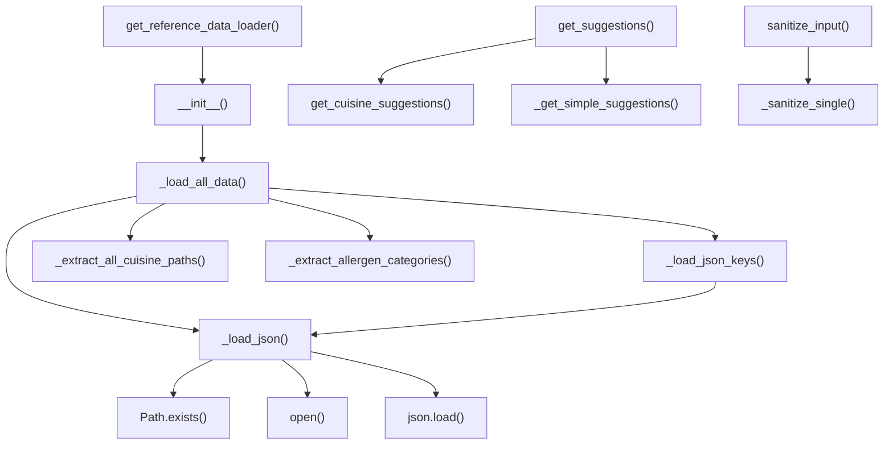

# Skill Output v1 — reference_data_loader.py — flowchart TB

## Metadata
- Skill node count: 15 (diagram count)
- Skill edge count: 13 (diagram count)

## Mermaid Diagram

Skill nodes: 15, Skill edges: 13

## Notes
- Extra nodes: json_load, open_file, path_exists (stdlib calls incorrectly treated as cross-file terminal nodes)
- Missing GT edge: get_cuisine_suggestions → _extract_all_cuisine_paths
- Missing GT nodes: ReferenceDataLoader() and __new__() (constructor detail; GT calibration issue)
- Root cause: cross-file terminal nodes rule applied to stdlib (json, pathlib) instead of only project-internal DB utilities
