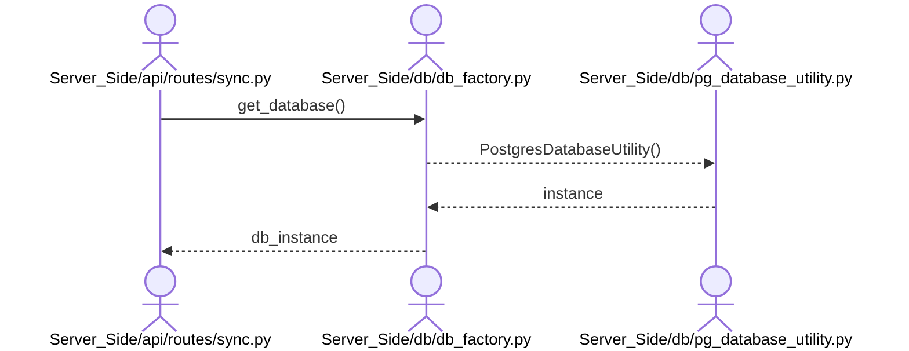

# Skill Output v2 — sync.py — sequenceDiagram

## Metadata
- Skill actor count: 3
- Skill message count: 4
- Rules applied: Python-files-only, no-library-traversal

## Mermaid Diagram

actors: 3, messages: 4

## Notes
- Python-files-only rule: no FastAPI Client or PostgreSQL DB actors (PASS)
- No-library-traversal rule: VIOLATED — factory→pgutil and pgutil→factory arrows show library internals
- Missing: sync→pgutil: db.execute(SELECT from DataVersions) and sync→pgutil: db.fetchall()
- Root cause: agent treated db.execute/db.fetchall as "unresolved" calls not mapped to .py files
  (parser gap: instance method calls on objects returned from another file not captured as cross-file edges)
