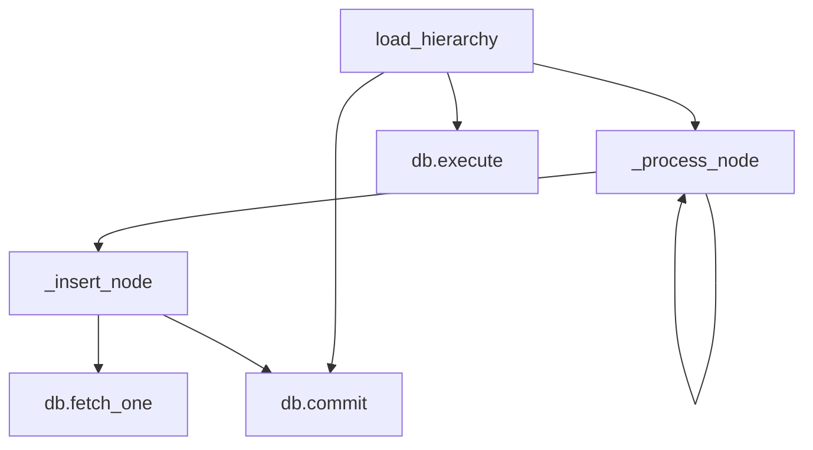

# Eval: cuisine_hierarchy_loader.py v3 — flowchart TB

**Version:** v3 (v2 failed with hallucination=0.43)
**New rules applied:** shared-terminal-node, main-pipeline-only, stdlib-exclusion

## GT Diagram

GT nodes (6 distinct): load_hierarchy, _process_node, _insert_node, db.execute, db.commit, db.fetch_one
GT edges (7): load_hierarchy→_process_node, _process_node→_insert_node, _process_node→_process_node, load_hierarchy→db.execute, load_hierarchy→db.commit, _insert_node→db.fetch_one, _insert_node→db.commit

Excluded: _load_data (called in __init__, not load_hierarchy pipeline), generate_report (standalone utility method).
Shared-terminal-node: ONE db.commit node serves both load_hierarchy and _insert_node.

## Skill Diagram

From graph: load_hierarchy has intra-file calls to _process_node and unresolved execute/commit on self.db. _process_node calls _insert_node (intra-file) and recursively _process_node. _insert_node has unresolved fetch_one/commit. Cross-file terminal nodes rule applied (self.db from get_database()). Shared-terminal-node rule: ONE db.commit node.

## Grading

| Metric | Value |
|--------|-------|
| node_recall | 6/6 = 1.00 |
| edge_recall | 7/7 = 1.00 |
| hallucination | 0/13 = 0.00 |
| **result** | **PASS** |
