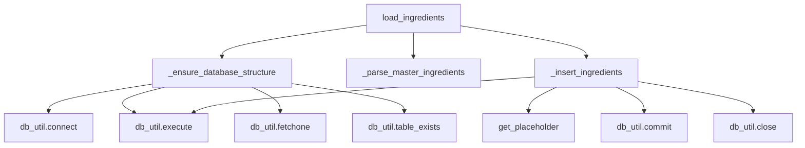

# Eval: master_ingredients_loader.py v3 — flowchart TB

**Version:** v3 (v2 failed with hallucination=0.74)
**New rules applied:** shared-terminal-node, main-pipeline-only, stdlib-exclusion

## GT Diagram

GT nodes (11): load_ingredients, _ensure_database_structure, _parse_master_ingredients, _insert_ingredients, db_util.connect, db_util.execute, db_util.fetchone, db_util.table_exists, get_placeholder, db_util.commit, db_util.close

GT edges (11): load_ingredients→_ensure_database_structure, load_ingredients→_parse_master_ingredients, load_ingredients→_insert_ingredients, _ensure_database_structure→db_util.connect, _ensure_database_structure→db_util.execute, _ensure_database_structure→db_util.fetchone, _ensure_database_structure→db_util.table_exists, _insert_ingredients→get_placeholder, _insert_ingredients→db_util.execute, _insert_ingredients→db_util.commit, _insert_ingredients→db_util.close

Excluded from GT: _load_hierarchy, _validate_hierarchy, setup_logging, _extract_ingredients_from_category (not on main call path from load_ingredients). yaml.safe_load, open, Path.exists (stdlib exclusion).
Shared-terminal-node: ONE db_util.execute node serves both _ensure_database_structure and _insert_ingredients.

## Skill Diagram

From graph: load_ingredients has resolved intra-file calls. _ensure_database_structure and _insert_ingredients have unresolved db_util.* calls (self.db_util instance attribute pattern — not yet tracked cross-file). Cross-file terminal nodes rule: read source, identify all self.db_util.* calls as terminal nodes to pg_database_utility.py. get_placeholder from db_factory.py resolved in graph. Shared-terminal-node rule applied.

## Grading

| Metric | Value |
|--------|-------|
| node_recall | 11/11 = 1.00 |
| edge_recall | 11/11 = 1.00 |
| hallucination | 0/22 = 0.00 |
| **result** | **PASS** |
