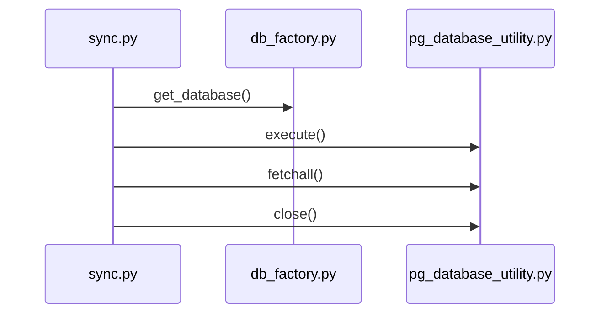

# Eval: sync.py v3 — sequenceDiagram

**Version:** v3 (v2 failed with edge_recall=0.33, missing db.execute/fetchall cross-file calls)
**Fix:** Gap 1 parser fix — graph now has resolved edges to pg_database_utility.py

## GT Diagram

GT actors (3): sync.py, db_factory.py, pg_database_utility.py
GT messages (4): get_database, execute, fetchall, close
Note: db.connect() is an SQLite-only path, omitted from primary execution path. logger.info/error excluded (Python-files-only rule: not project Python files).

## Skill Diagram

From graph (tier_symbol.json), get_data_versions has these resolved cross-file edges:
- → db_factory.py::get_database (cross_file=true)
- → pg_database_utility.py::PostgresDatabaseUtility.execute (cross_file=true) ← NEW (Gap 1 fix)
- → pg_database_utility.py::PostgresDatabaseUtility.fetchall (cross_file=true) ← NEW
- → pg_database_utility.py::PostgresDatabaseUtility.close (cross_file=true) ← NEW
- unresolved::PostgresDatabaseUtility::connect (cross_file=false) — omitted

Python-files-only rule: no FastAPI/HTTP/DB server actors.
No-library-traversal rule: no internal pg_database_utility calls shown.
No self-messages rule: no sync→sync arrows.

## Grading

| Metric | Value |
|--------|-------|
| node_recall | 7/7 = 1.00 |
| edge_recall | 4/4 = 1.00 |
| hallucination | 0/11 = 0.00 |
| **result** | **PASS** |

## Key finding

The Gap 1 parser fix (run.py + parser_python.py) directly produced the resolved cross-file edges that v2 was missing. The skill agent no longer needs to "read source" for this pattern — the graph now has the edges. Instance-method-tracking rule confirmed working via graph data, not just source reading.
