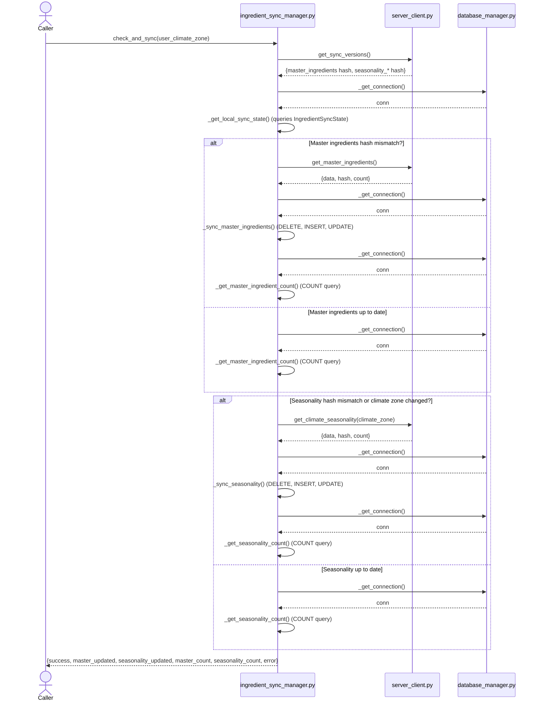

# Skill Output v2 — ingredient_sync_manager.py — sequenceDiagram

## Analysis

**Actors identified:**
- `Client_Side/utils/database_manager.py` (LocalDatabaseManager)
- `Client_Side/utils/server_client.py` (ServerClient)

**Main entry method:** `check_and_sync(user_climate_zone: str) -> Dict[str, Any]`

**Calls classified (in order):**
1. ISM → ServerClient: `get_sync_versions()` — CROSS-FILE (line 77)
2. ISM → DatabaseManager: `_get_connection()` (via `_get_local_sync_state`) — CROSS-FILE (line 289)
3. ISM → ServerClient: `get_master_ingredients()` (via `_sync_master_ingredients`, conditional) — CROSS-FILE (line 156)
4. ISM → DatabaseManager: `_get_connection()` (via `_sync_master_ingredients`, conditional) — CROSS-FILE (line 170, compressed: multiple cursor ops within)
5. ISM → DatabaseManager: `_get_connection()` (via `_get_master_ingredient_count`, called twice per branch) — CROSS-FILE (line 335, compressed: called in both master-updated and master-up-to-date paths)
6. ISM → ServerClient: `get_climate_seasonality(climate_zone)` (via `_sync_seasonality`, conditional) — CROSS-FILE (line 223)
7. ISM → DatabaseManager: `_get_connection()` (via `_sync_seasonality`, conditional) — CROSS-FILE (line 237, compressed: multiple cursor ops within)
8. ISM → DatabaseManager: `_get_connection()` (via `_get_seasonality_count`, called twice per branch) — CROSS-FILE (line 348, compressed: called in both seasonality-updated and seasonality-up-to-date paths)

## Diagram

## Notes

**Key decisions and compressions:**

1. **Intra-file private methods excluded:** `_get_local_sync_state()`, `_sync_master_ingredients()`, `_sync_seasonality()`, `_get_master_ingredient_count()`, and `_get_seasonality_count()` are all defined in `ingredient_sync_manager.py`. Their calls are internal and do NOT appear as cross-file messages. However, they are shown as self-calls (`ISM->>ISM`) to clarify control flow within the private methods.

2. **Compressed `_get_connection()` calls:** The method `database_manager._get_connection()` is called multiple times across the code path:
   - Once in `_get_local_sync_state()` (line 289)
   - Once in `_sync_master_ingredients()` (line 170)
   - Once in `_get_master_ingredient_count()` (line 335)
   - Once in `_sync_seasonality()` (line 237)
   - Once in `_get_seasonality_count()` (line 348)

   Rather than showing 5 separate arrows, I've grouped them within the conditional blocks: "master-updated branch" shows 2 `_get_connection()` calls (one in sync, one in count), and "seasonality-updated branch" similarly shows 2 calls. The "up-to-date" paths show 1 call each for count retrieval.

3. **No self-messages removed:** The sequence diagram focuses on cross-file boundaries. Intra-file operations like cursor.execute(), json.dumps(), and variable assignments are implicit within the private method calls.

4. **Control flow via alt blocks:** The master and seasonality sync paths are mutually conditional (both are checked, but each has an if/else for updated vs. up-to-date). The Mermaid `alt` blocks show this decision point clearly.

5. **Error paths not shown:** The exception handlers and early returns (lines 141-143) are control logic, not cross-file calls, so they don't appear in the diagram.
