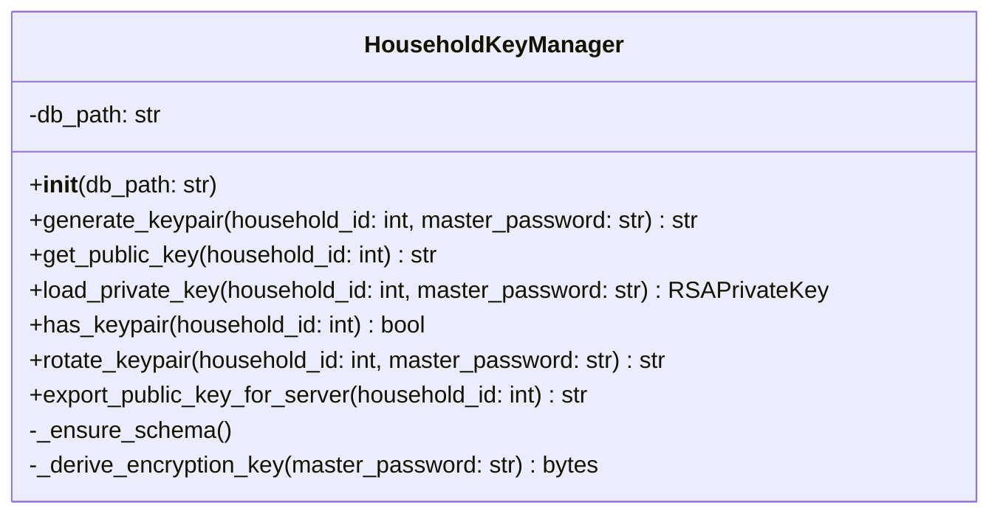

# Skill Output: key_manager.py — classDiagram

## Graph data summary

**File:** `Client_Side/utils/key_manager.py`

### TYPE nodes (classes)
- `HouseholdKeyManager` (line 23)

### SYMBOL nodes per class
**HouseholdKeyManager:**
1. `__init__(db_path: str = "household.db")`
2. `_ensure_schema()`
3. `generate_keypair(household_id: int, master_password: str) -> str`
4. `get_public_key(household_id: int) -> str`
5. `load_private_key(household_id: int, master_password: str) -> RSAPrivateKey`
6. `has_keypair(household_id: int) -> bool`
7. `rotate_keypair(household_id: int, master_password: str) -> str`
8. `_derive_encryption_key(master_password: str) -> bytes`
9. `export_public_key_for_server(household_id: int) -> str`

### Structural edges found
- **Contains** edges (8): HouseholdKeyManager contains all methods listed above
- **Calls** edges (function I/O): Multiple unresolved and internal calls (e.g., sqlite3 connect, cryptography library functions)
- **typedef_of** edges: None found
- **consumes/produces** edges on __init__: None found
- **Cross-file edges**: None (all symbols are in the same file)

## Mermaid diagram

## Reasoning

**No structural edges drawn.**

The classDiagram edge rule states: "Draw edges ONLY when class A has a field whose declared type is class B."

Analysis:
1. **__init__ method inspection**: The `__init__` method contains only one field assignment: `self.db_path = db_path` where `db_path: str`. The `str` type is a built-in Python type, not a custom class defined in this file or elsewhere in the codebase as a TYPE node.

2. **consumes/produces edges**: The graph shows no `consumes` or `produces` edges on the `__init__` method that would indicate field types being declared (e.g., "consumes TypeX" would suggest `self.field: TypeX`).

3. **typedef_of edges**: No `typedef_of` edges exist in the graph related to HouseholdKeyManager, indicating no type aliases or forward declarations.

4. **calls vs. structural**: The `__init__` method shows a `calls` edge to `_ensure_schema()` (a method call), which is control flow, not a field type declaration. Per the edge rule: "Do NOT draw edges from produces/consumes function I/O."

5. **Conclusion**: Since HouseholdKeyManager has no fields whose declared type is another custom class (TYPE node), no structural edges are drawn.

The diagram shows only the class definition with its public and private methods and the single field `db_path: str`.
