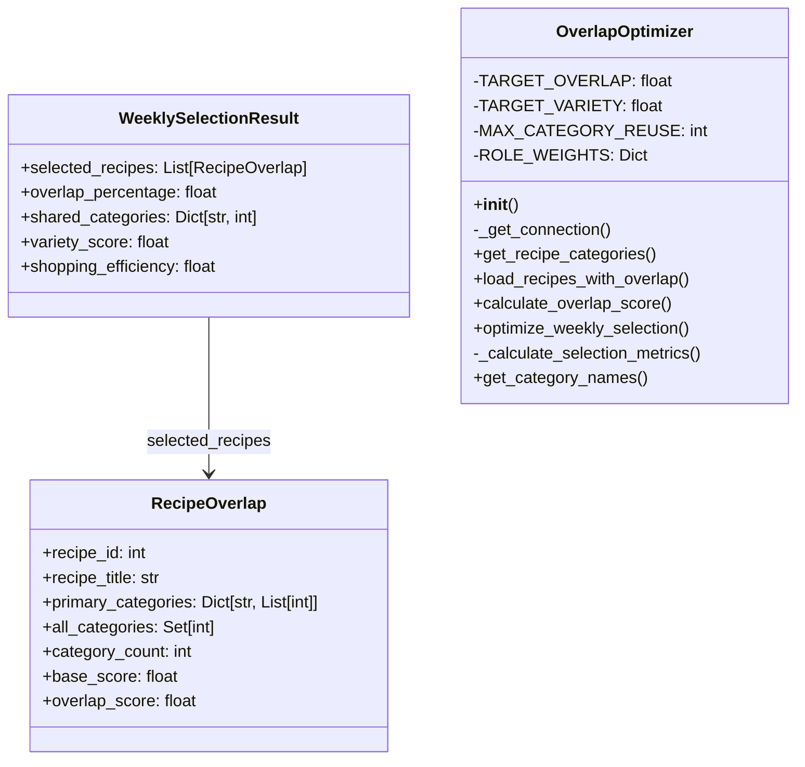

# Skill Output: overlap_optimizer.py — classDiagram

## Graph data summary
- Nodes found: 23 (3 TYPE nodes + 20 SYMBOL nodes)
- TYPE nodes (classes): RecipeOverlap, WeeklySelectionResult, OverlapOptimizer
- Structural edges found: 1 (uses_type relation indicating field type)

## Mermaid diagram

## Reasoning

**Edges drawn:**
- `WeeklySelectionResult --> RecipeOverlap` (field-type relationship) — The graph contains a `uses_type` edge (line 111448) indicating that the `selected_recipes` field (line 111441-1442) is declared as `List[RecipeOverlap]`. This satisfies the classDiagram rule: class A has a field whose declared type is class B.

**Edges excluded:**
- **Produces/Consumes edges** — The graph contains `produces` edges where methods return RecipeOverlap or WeeklySelectionResult (e.g., lines 111555-1558, 111635-1638). These indicate *data pipeline flow* (function output), not *structural field declarations*. Per SKILL.md, "Do NOT draw edges from produces/consumes function I/O (pipeline dependencies are not structural relationships)."
- **Calls edges** — OverlapOptimizer methods call RecipeOverlap constructors (line 111602) and WeeklySelectionResult constructors (line 111688). These are control flow edges, not field-type declarations. Per the rule, structural edges require declared field types in the class body, not dynamic instantiation.
- **No OverlapOptimizer fields** — The graph shows no `uses_type` or field-type edges from OverlapOptimizer to other classes. The class manages RecipeOverlap and WeeklySelectionResult instances internally, but does not declare them as typed instance fields in the class signature (it uses them as local variables within methods).

**Data extracted:**
- RecipeOverlap: 7 dataclass fields with primitive and generic types (int, str, Dict, Set, float)
- WeeklySelectionResult: 5 dataclass fields, including one that references RecipeOverlap
- OverlapOptimizer: Class constants (TARGET_OVERLAP, etc.) shown as private fields; 8 methods including __init__ and optimization logic
